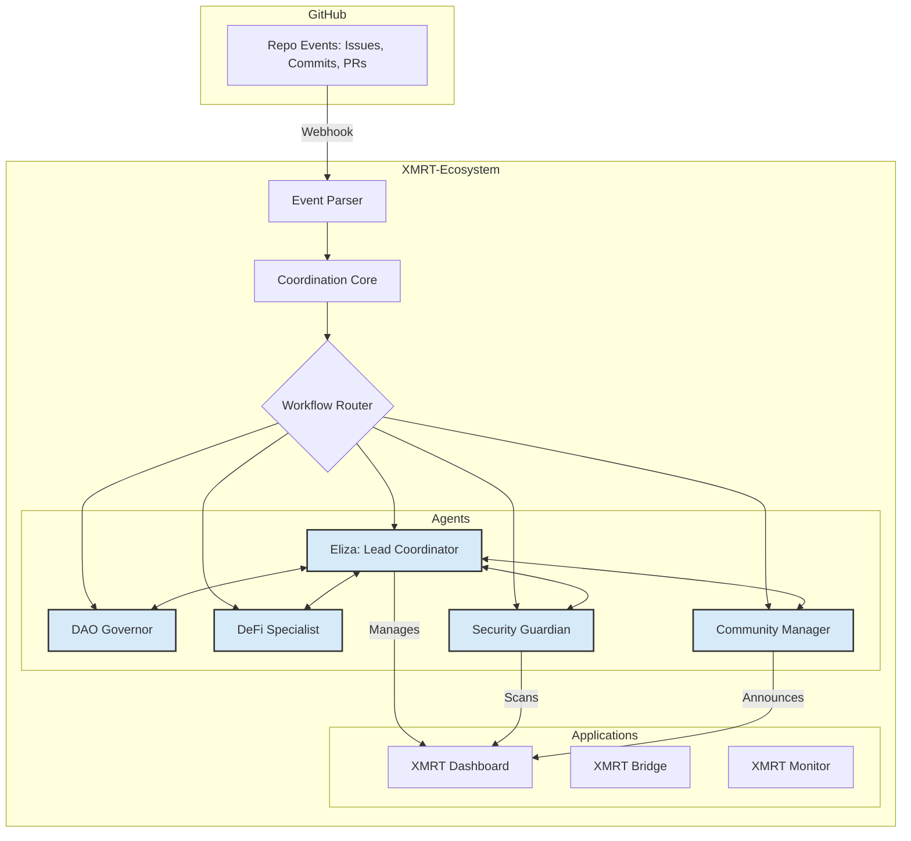

# 🚀 XMRT-Ecosystem - Enhanced Autonomous AI-Powered DAO Platform

**Last Updated**: 2025-09-30 14:20:00 UTC
**System Version**: 4.0.0-enhanced-coordination
**Mode**: Real Autonomous Operations with Enhanced Coordination

[](https://github.com/DevGruGold/XMRT-Ecosystem)
[](https://github.com/DevGruGold/XMRT-Ecosystem)
[](https://github.com/DevGruGold/XMRT-Ecosystem)
[](https://github.com/DevGruGold/XMRT-Ecosystem)

## 🌟 Overview

XMRT-Ecosystem is a **fully autonomous, AI-powered decentralized autonomous organization (DAO)** platform that demonstrates cutting-edge AI integration, real-time learning, and multi-agent collaboration. This enhanced version restores and improves agent coordination, integrates existing applications, and provides a unified system for collaborative autonomous development.

### ✨ **ENHANCED FEATURES**

🧠 **Enhanced Agent Coordination**
- **Restored Coordination**: Agents now collaborate on issues, commits, and pull requests.
- **Collaborative Workflows**: Event-driven system enables agents to work together on complex tasks.
- **Role-Based Collaboration**: Specialized agents contribute their expertise to enhance system development.
- **Real-time Monitoring**: New dashboard provides visibility into agent coordination and system health.

🤖 **Integrated Application Ecosystem**
- **XMRT Ecosystem Dashboard**: Now integrated with the coordination core for real-time status updates.
- **XMRT Integration Bridge**: Actively coordinates data flow between ecosystem components.
- **XMRT Repository Monitor**: Feeds data to the dashboard and triggers coordination events.

🔗 **GitHub Integration & Automation**
- Automated repository analysis and code generation
- Pull request automation and review assistance
- Issue tracking and repository monitoring
- CI/CD enhancement and optimization

## 🏗️ **System Architecture**



## 🚀 **Quick Start**

### Prerequisites

- Python 3.9+
- Node.js 20+ (for frontend dependencies)
- API keys for AI services (OpenAI, Gemini, Anthropic)

### Installation

1. **Clone the repository**
   ```bash
   git clone https://github.com/DevGruGold/XMRT-Ecosystem.git
   cd XMRT-Ecosystem
   ```

2. **Install Python dependencies**
   ```bash
   pip install -r requirements.txt
   ```

3. **Environment Configuration**
   ```bash
   cp .env.example .env
   # Edit .env with your API keys and configuration
   ```

4. **Run the Enhanced Application**
   ```bash
   # Run the enhanced system with coordination
   python main_enhanced_coordination.py
   ```

## ⚙️ **Configuration**

### Core Settings

```bash
# Core Application
SECRET_KEY=your-ultra-secure-secret-key
FLASK_DEBUG=false
HOST=0.0.0.0
PORT=10000

# AI Model Configuration
OPENAI_API_KEY=sk-your-openai-key

# GitHub Integration
GITHUB_TOKEN=your-github-token
GITHUB_OWNER=DevGruGold
GITHUB_REPO=XMRT-Ecosystem
```

See [`.env.example`](.env.example) for complete configuration options.

## 📚 **API Documentation**

### Coordination System
```http
GET /api/coordination/status
```
Returns the status of the agent coordination system.

### Agent Management
```http
GET /api/agents/status
```
Get detailed status of all autonomous agents.

### Application Integration
```http
GET /api/applications/status
```
Get the status of all integrated applications.

## 🤖 **Enhanced Multi-Agent System**

### Agent Roles and Responsibilities

| Agent | Role | Responsibilities |
|---|---|---|
| **Eliza** | Lead Coordinator | Triages events, assigns tasks, monitors ecosystem health |
| **DAO Governor** | Governance | Manages proposals, enforces policies, reviews compliance |
| **DeFi Specialist** | Finance | Analyzes financial impacts, monitors DeFi applications |
| **Security Guardian** | Security | Scans for vulnerabilities, monitors application security |
| **Community Manager** | Engagement | Manages community discussions, updates documentation |

### Agent Communication

Agents now communicate through the **Coordination Core**, enabling:
- Collaborative issue resolution
- Coordinated pull request reviews
- Shared context and knowledge
- System-wide performance optimization

## 🔧 **Development**

### Project Structure

```
XMRT-Ecosystem/
├── main_enhanced_coordination.py # Main application with coordination
├── xmrt_coordination_core.py    # Agent coordination system
├── xmrt_apps/                   # Integrated applications
│   ├── xmrt_ecosystem_dashboard.py
│   ├── xmrt_integration_bridge.py
│   └── xmrt_repository_monitor.py
├── requirements.txt           # Python dependencies
├── .env.example              # Environment configuration template
└── docs/                     # Documentation
```

### Contributing

1. Fork the repository
2. Create a feature branch: `git checkout -b feature/amazing-feature`
3. Commit changes: `git commit -m 'Add amazing feature'`
4. Push to branch: `git push origin feature/amazing-feature`
5. Open a Pull Request

## 🛡️ **Security & Privacy**

- **Environment-based Configuration**: Sensitive data stored in environment variables
- **API Authentication**: Optional API key authentication for enhanced security
- **Rate Limiting**: Built-in protection against abuse and overuse
- **Input Sanitization**: Comprehensive input validation and sanitization

## 📈 **Deployment**

### Production Deployment

1. **Environment Setup**
   ```bash
   # Set production environment variables
   export FLASK_ENV=production
   export FLASK_DEBUG=false
   ```

2. **Gunicorn Configuration**
   ```bash
   gunicorn -w 2 -k gevent --bind 0.0.0.0:$PORT main_enhanced_coordination:main
   ```

### Cloud Deployment

- **Render**: Configured with `render.yaml` for easy deployment

## 🔄 **System Health**

### Health Monitoring

The enhanced system includes comprehensive health monitoring:

- **Coordination Health**: Real-time status of agent coordination
- **Application Health**: Status of all integrated applications
- **Agent Performance**: Coordination scores and activity levels

